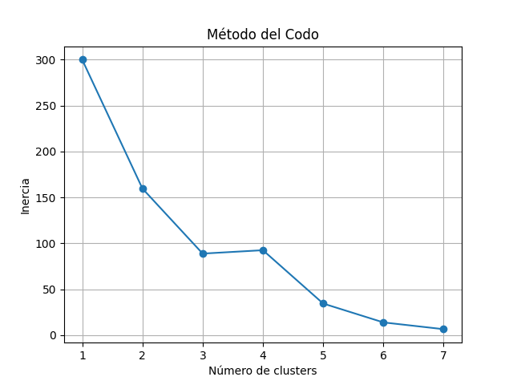
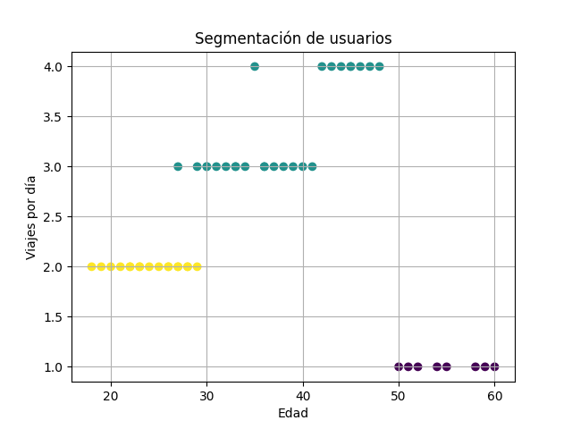

# 🚍 Proyecto de Inteligencia Artificial

## Clustering aplicado al Transporte Masivo


---

## 📌 Descripción del Proyecto

Este proyecto implementa técnicas de **aprendizaje no supervisado**, específicamente el algoritmo **K-Means**, con el objetivo de identificar patrones de comportamiento en los usuarios de un sistema de transporte masivo.

A partir del análisis de datos, se logra segmentar a los usuarios en diferentes grupos, lo que permite mejorar la toma de decisiones en la optimización del servicio.

---

## 🧠 Objetivo

Aplicar técnicas de **clustering** para:

* Identificar perfiles de usuarios
* Analizar patrones de uso del transporte
* Proponer mejoras en rutas y tiempos de espera

---

## 📊 Dataset

El conjunto de datos utilizado contiene información simulada de usuarios del sistema de transporte:

| Variable      | Descripción                         |
| ------------- | ----------------------------------- |
| usuario_id    | Identificador del usuario           |
| edad          | Edad del usuario                    |
| viajes_dia    | Número de viajes diarios            |
| hora_pico     | Uso en hora pico (1 = sí, 0 = no)   |
| ruta          | Ruta utilizada (A, B, C)            |
| tiempo_espera | Tiempo de espera en minutos         |
| metodo_pago   | Método de pago (tarjeta / efectivo) |

---

## ⚙️ Tecnologías utilizadas

* 🐍 Python
* 📊 Pandas
* 🤖 Scikit-learn
* 📈 Matplotlib

---

## 🧪 Metodología

1. Carga de datos
2. Preprocesamiento
3. Normalización
4. Aplicación del algoritmo K-Means
5. Evaluación con el método del codo
6. Visualización de resultados

---

## 📉 Método del Codo



Se utilizó el método del codo para determinar el número óptimo de clusters, concluyendo que el valor ideal es **K = 3**.

---

## 📊 Resultados del Clustering



El modelo permitió identificar tres grupos principales de usuarios:

* 🔵 **Cluster 0:** Usuarios frecuentes (alto uso del sistema)
* 🟢 **Cluster 1:** Usuarios ocasionales
* 🔴 **Cluster 2:** Usuarios de uso moderado

---

## 🚀 Cómo ejecutar el proyecto

```bash
# Clonar repositorio
git clone https://github.com/j14sierra/M-todos-de-aprendizaje-no-supervisado.git

# Entrar a la carpeta
cd M-todos-de-aprendizaje-no-supervisado

# Instalar dependencias
pip install -r requirements.txt

# Ejecutar modelo
python src/modelo_transporte.py
```

---

## 📦 Requerimientos del sistema

El proyecto utiliza las siguientes librerías de Python:

pandas>=1.5.0
matplotlib>=3.7.0
scikit-learn>=1.3.0

También puedes generar este archivo automáticamente con:

pip freeze > requirements.txt

## 📁 Estructura del proyecto

```
proyecto-transporte-ia/
│
├── data/
├── src/
├── docs/
├── video/
├── README.md
└── requirements.txt
```

---

## 🎥 Video explicativo

👉 [Ver video Explicativo](https://tu-link-aqui.com)

---

## 📌 Conclusiones

El uso de técnicas de clustering permitió identificar patrones clave en el comportamiento de los usuarios del transporte, lo cual puede ser utilizado para:

* Optimizar rutas
* Reducir tiempos de espera
* Mejorar la eficiencia del servicio

---

## 👥 Integrantes

* Johan Camilo Sierra

---

## 📚 Referencias

* Palma Méndez, J. T. (2008). *Inteligencia Artificial: métodos, técnicas y aplicaciones*. McGraw-Hill.

---

⭐ Si este proyecto te parece útil, ¡no olvides darle una estrella!
